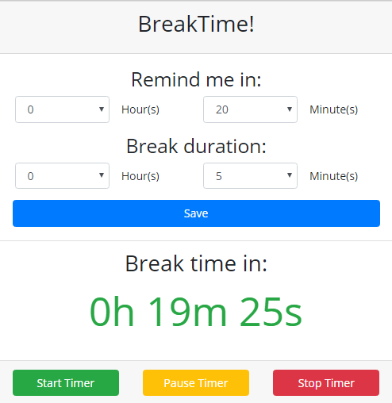
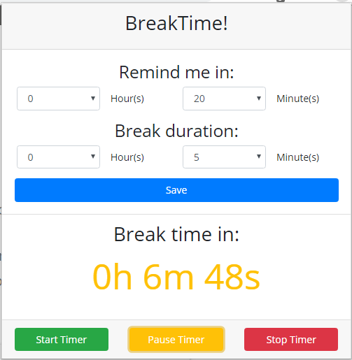
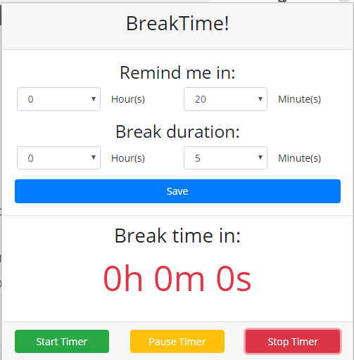

# BreakTime
This is a google chrome extension that will set a timer and alert you when you should take a break.

The user will be able to change how long their break duration and when the extension should remind them to take a break. All settings are synced across all browers that the user have signed into.

This extension can be found [here](https://chrome.google.com/webstore/detail/breaktime/innijcgopkmhganfbonmpokhddnonihl).

